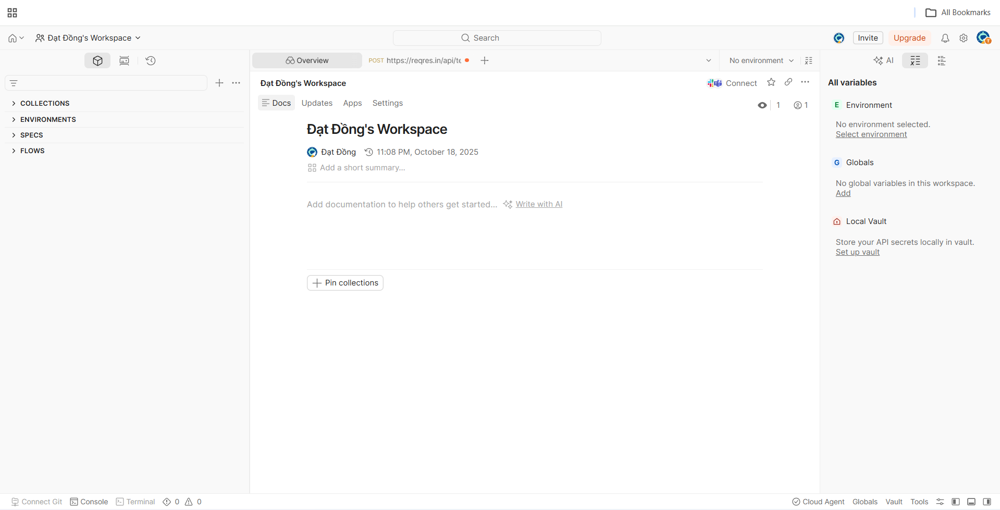
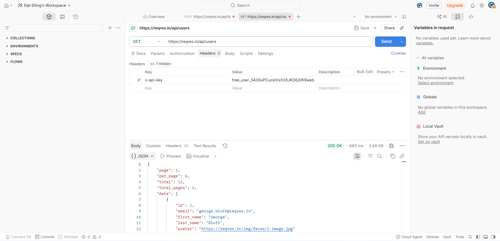
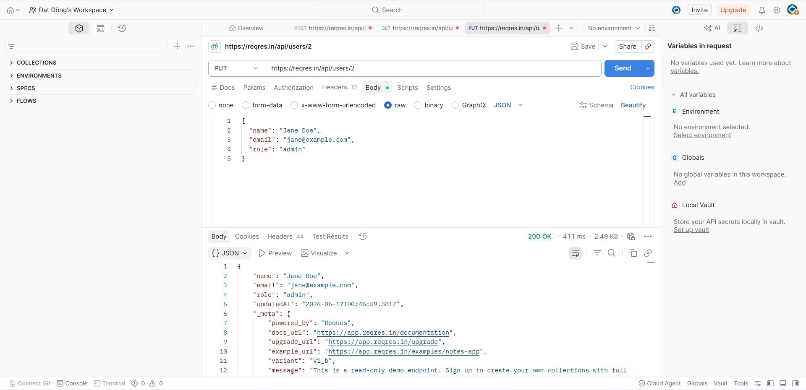
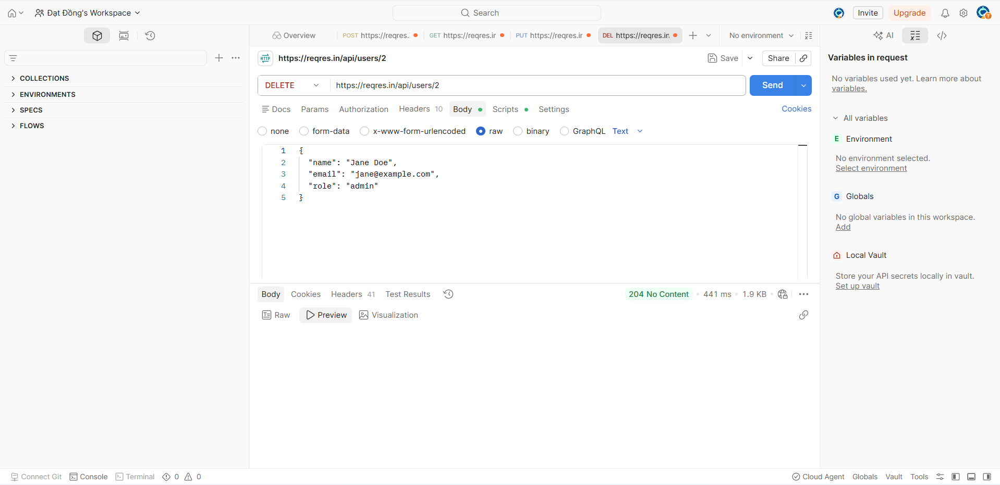

# Báo cáo thực hành kiểm thử API bằng Postman

## 1. Giới thiệu

Postman là một nền tảng toàn diện cho việc phát triển, sử dụng và quản lý API. Nó cung cấp nhiều tính năng giúp các nhà phát triển và tester dễ dàng tạo, gửi, kiểm tra và chia sẻ các yêu cầu API. Postman hiện là một trong những công cụ phổ biến nhất được sử dụng trong lĩnh vực kiểm thử API. Dưới đây là một số tính năng chính của Postman: • Tạo yêu cầu HTTP: Postman cho phép bạn tạo các yêu cầu HTTP với nhiều phương thức khác nhau (GET, POST, PUT, DELETE, v.v.). Bạn có thể nhập URL API, thêm header, body và các tham số yêu cầu.expand_more • Gửi yêu cầu và xem phản hồi: Postman cho phép bạn gửi các yêu cầu HTTP đến API và xem phản hồi.expand_more Bạn có thể xem mã trạng thái HTTP, header, body và nội dung phản hồi.expand_more • Kiểm tra API: Postman cung cấp nhiều công cụ để giúp bạn kiểm tra API, bao gồm trình soạn thảo JSON, trình xác minh JSON, trình gỡ lỗi và bộ sưu tập. • Chia sẻ API: Postman cho phép bạn chia sẻ các yêu cầu, bộ sưu tập và môi trường với những người khác. Điều này giúp bạn dễ dàng cộng tác với các nhà phát triển và tester khác. • Quản lý môi trường: Postman cho phép bạn quản lý nhiều môi trường API khác nhau.expand_more Điều này giúp bạn dễ dàng kiểm thử API trong các môi trường khác nhau (ví dụ: phát triển, thử nghiệm, sản xuất).expand_more • Tự động hóa: Postman cung cấp các tính năng tự động hóa giúp bạn tự động hóa các tác vụ kiểm thử API.expand_more • Bảo mật: Postman hỗ trợ các tính năng bảo mật như xác thực và ủy quyền.

## 2. Công cụ sử dụng

- Postman
- GitHub
- API demo: https://reqres.in/

## 3. Nội dung thực hiện

Trong bài thực hành, em đã tạo một collection trên Postman để kiểm thử các API cơ bản, bao gồm:

| STT | Method | API | Mục đích |
|---|---|---|---|
| 1 | GET | /api/users/2 | Lấy thông tin một người dùng |
| 2 | PUT | /api/users/2 | Cập nhật người dùng |
| 3 | DELETE | /api/users/2 | Xóa người dùng |
| 4 | POST | /api/users | Tạo người dùng mới |

## 4. Kết quả thực hiện

### 4.1. Tạo Giao diện overview

### 4.2. Kiểm thử request GET

### 4.3. Kiểm thử request POST

### 4.4. Viết test script và kiểm tra kết quả

### 4.5. Chạy Collection Runner

## 5. Nhận xét

Thông qua bài thực hành, em đã hiểu cách sử dụng Postman để gửi các request HTTP như GET, POST, PUT và DELETE. Ngoài ra, em cũng biết cách viết test script để kiểm tra status code, dữ liệu trả về và chạy tự động nhiều request bằng Collection Runner.

## 6. Kết luận

Postman là công cụ hữu ích trong kiểm thử API, giúp kiểm tra nhanh chức năng của backend, xác minh dữ liệu phản hồi và hỗ trợ tự động hóa kiểm thử ở mức cơ bản.
