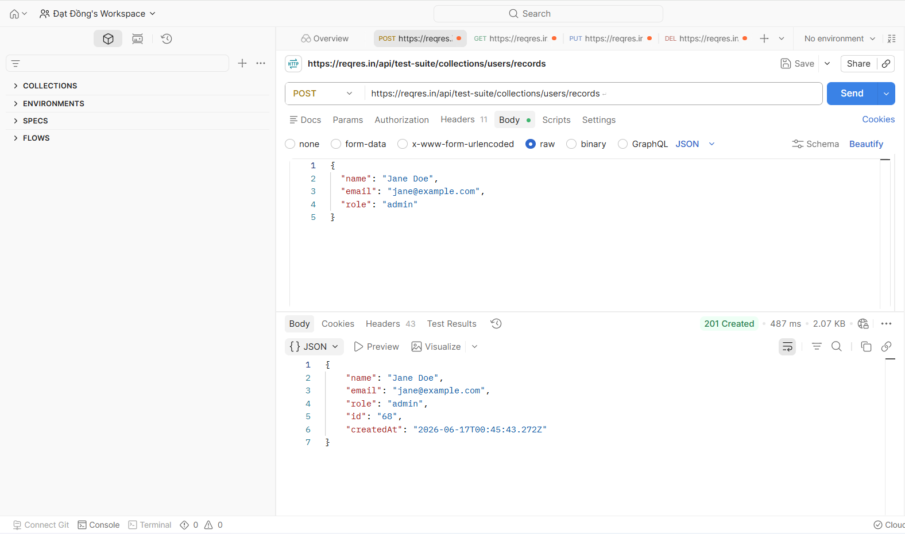

# THỰC HÀNH LAB: KIỂM THỬ API TỰ ĐỘNG VỚI POSTMAN

**Thông tin sinh viên:**
* **Họ và tên:** Đồng Đại Đạt  
* **Mã sinh viên:** 23010877  

---

## 1. GIỚI THIỆU VỀ POSTMAN

**Postman** là một nền tảng quản trị và thực thi kiểm thử API toàn diện, đóng vai trò cốt lõi trong quy trình phát triển, tích hợp và vận hành phần mềm hiện đại. Công cụ cung cấp giải pháp đóng gói mạnh mẽ giúp các Kỹ sư Đảm bảo Chất lượng (QA/Tester) và Nhà phát triển (Developer) dễ dàng khởi tạo, gửi, tối ưu hóa và chia sẻ các yêu cầu kiểm thử.

Các tính năng chiến lược của Postman bao gồm:
* **Khởi tạo yêu cầu linh hoạt:** Hỗ trợ toàn diện các phương thức HTTP tiêu chuẩn (như `GET`, `POST`, `PUT`, `DELETE`), cho phép cấu hình linh hoạt các tham số đường dẫn (*Params*), tiêu đề (*Headers*), và mã nguồn thân dữ liệu (*Body*).
* **Phân tích phản hồi trực quan:** Hiển thị chi tiết cấu trúc phản hồi từ máy chủ, bao gồm mã trạng thái (*HTTP Status Code*), thời gian phản hồi (*Response Time*), dung lượng gói tin và định dạng dữ liệu (JSON, XML,...).
* **Kiểm thử tự động & Kịch bản hóa:** Tích hợp trình soạn thảo JavaScript mạnh mẽ cho phép xây dựng các đoạn mã kiểm thử (*Test Scripts*) nhằm tự động hóa việc xác minh dữ liệu phản hồi ngay sau khi gửi yêu cầu.
* **Quản trị môi trường biến (Environment Management):** Hỗ trợ phân tách và quản lý các tập biến cấu hình giữa các môi trường vận hành độc lập như *Development*, *Staging*, và *Production*.
* **Tối ưu hóa quy trình với Collection Runner:** Cho phép tự động hóa việc thực thi hàng loạt các yêu cầu kiểm thử theo chuỗi kịch bản định sẵn một cách nhanh chóng và chính xác.

---

## 2. CÔNG CỤ VÀ MÔI TRƯỜNG SỬ DỤNG

* **Công cụ chính:** Postman Desktop Application.
* **Quản lý mã nguồn:** GitHub.
* **Hệ thống API giả lập (Mock API):** Sử dụng dịch vụ mở [ReqRes API](https://reqres.in/) làm đối tượng kiểm thử.

---

## 3. NỘI DUNG THỰC HIỆN

Trong phạm vi bài thực hành, một bộ sưu tập kiểm thử (*Test Collection*) đã được thiết lập để đánh giá và kiểm thử toàn diện các phương thức API CRUD cơ bản dựa trên các Endpoint sau:

| STT | Phương thức | API Endpoint | Mục tiêu kiểm thử |
| :---: | :---: | :--- | :--- |
| 1 | **GET** | `/api/users/2` | Truy vấn và kiểm tra thông tin chi tiết của một người dùng cụ thể. |
| 2 | **PUT** | `/api/users/2` | Gửi dữ liệu cập nhật và xác minh thay đổi thông tin người dùng. |
| 3 | **DELETE** | `/api/users/2` | Thực hiện yêu cầu xóa tài khoản người dùng khỏi hệ thống. |
| 4 | **POST** | `/api/users` | Khởi tạo dữ liệu người dùng mới lên hệ thống cơ sở dữ liệu. |

---

## 4. KẾT QUẢ THỰC HIỆN KỊCH BẢN

Dưới đây là các hình ảnh ghi nhận thực tế quá trình cấu hình kịch bản và kết quả phản hồi của hệ thống API trên giao diện Postman:

### 4.1. Tổng quan bộ sưu tập kiểm thử (Collection Overview)
*Giao diện tổ chức cấu trúc thư mục lưu trữ và thiết lập luồng kiểm thử tự động của Collection.*

### 4.2. Thực thi yêu cầu truy vấn dữ liệu (GET Request)
*Xác minh khả năng đọc dữ liệu từ máy chủ, kiểm tra tính đúng đắn của cấu trúc JSON trả về.*

### 4.3. Thực thi yêu cầu cập nhật dữ liệu (PUT Request)
*Gửi gói tin cấu trúc sửa đổi thông tin nhân sự và ghi nhận phản hồi thay đổi thành công.*

### 4.4. Thực thi yêu cầu xóa dữ liệu (DELETE Request)
*Kiểm tra tính năng hủy bản ghi người dùng và xác minh mã trạng thái xóa thành công từ Server.*

### 4.5. Thực thi yêu cầu tạo mới dữ liệu (POST Request)
*Đẩy luồng thông tin người dùng mới lên máy chủ và xác thực bản ghi đã được khởi tạo thành công.*

---

## 5. ĐÁNH GIÁ VÀ NHẬN XÉT

Thông qua quá trình thực hành thực tế, em đã gặt hái được các kết quả kỹ năng quan trọng:
* Làm chủ phương thức vận hành và giao tiếp giữa Client - Server thông qua các giao thức thiết yếu `GET`, `POST`, `PUT`, `DELETE`.
* Nâng cao tư duy kiểm thử phần mềm bằng việc tự viết các đoạn mã kịch bản kiểm thử (*Test Scripts*) bằng JavaScript để tự động xác thực mã trạng thái (*Status Code 200/201/204*), thời gian phản hồi (*Response Time Line*) và kiểm tra tính toàn vẹn của dữ liệu thuộc tính trong chuỗi JSON.
* Biết cách tối ưu hóa hiệu suất làm việc bằng công cụ *Collection Runner*, tự động hóa chuỗi kiểm thử liên hoàn thay vì thao tác thủ công từng bước.

---

## 6. KẾT LUẬN

Bài thực hành đã hoàn thành trọn vẹn và đạt mục tiêu đề ra. Postman khẳng định vị thế là một trong những giải pháp kiểm thử API hàng đầu, giúp tối giản hóa công tác kiểm tra chức năng hệ thống Backend, cam kết độ chính xác dữ liệu đầu ra và mở ra nền tảng vững chắc cho việc triển khai tự động hóa kiểm thử nâng cao (*API Test Automation*) trong các dự án thực tế.
